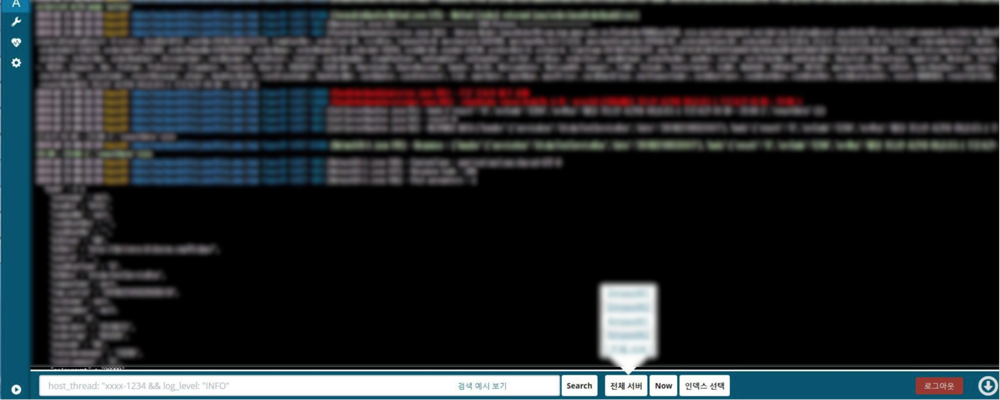

# LogTrail - Log Viewer plugin for Kibana

LogTrail에 자세한 내용은 [여기](https://github.com/sivasamyk/logtrail/)를 참고하세요



## 설명
기존 logtrail에 유저별 index 목록을 다르게 표기할 수 있는 기능을 추가하였습니다.\
elastic 6.8 버전 이상 부터는 키바나 로그인 기능을 기본으로 지원하여 플러그인 내 로그인 기능을 삭제 하였고, 키비나 로그인 유저 계정 정보를 사용합니다.  

## 환경 구성 (Kibana 7.2 기준)
[여기](https://github.com/parkjungwoong/elastic-stack/blob/master/kibana/%ED%94%8C%EB%9F%AC%EA%B7%B8%EC%9D%B8%20%EA%B0%9C%EB%B0%9C%20%ED%99%98%EA%B2%BD%20%EC%84%A4%EC%A0%95.md) 참고하여 구성

## 설정 파일
 - 기본 설정 파일 형식은 [여기](https://github.com/sivasamyk/logtrail#configuration) 참고
 - 계정별 인덱스 리스트 예시 :
     ```
     {
       "list": [
         {
           "id": "super",
           "indexList": "*" //모든 인덱스를 조회할 계정은 '*' 로 설정
         },
         {
           "id": "apiUser",
           "indexList": ["api-*"] //나머지는 배열 형식으로 작성
         },
         {
           "id": "admUser",
           "indexList": ["adm-*", "api-*"]
         }
       ]
     }
     ```
 - 로컬 파일 설정은 지원하지 않고 elasticsearch에 설정 정보를 입력
    ```
    #설정 파일 작성 후 저장
    vi logtrail.json
    #설정 파일 내용을 elasticsearch에 저장
    curl -XPUT 'localhost:9200/.logtrail/config/1?pretty' -H 'Content-Type: application/json' -d@./logtrail.json -u el계정:el비밀번호
    
    #계정별 인덱스 정보 작성
    vi user.json
    curl -XPUT 'localhost:9200/.logtrail/config/2?pretty' -H 'Content-Type: application/json' -d@./user.json -u el계정:el비밀번호
    ```